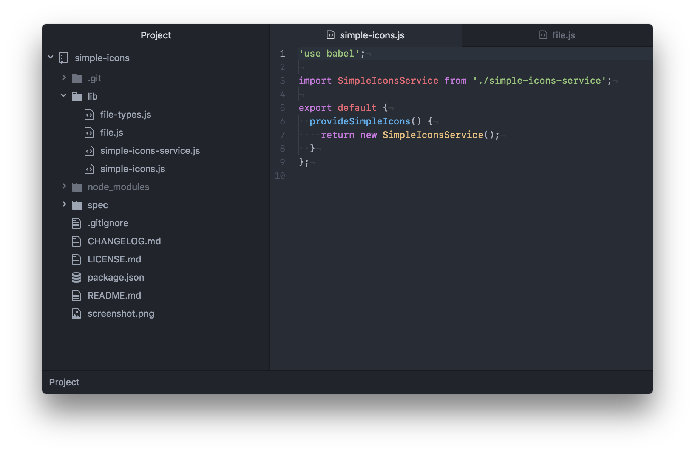

# Simple Icons

[Atom][atom] package for better (but simple) file icons.

## Installation
Open **Settings** → **Install** and search for `simple-icons`.

Alternatively, install through command-line:

```sh
$ apm install simple-icons
```

## Description

I found [file-icons][file-icons] package very distracting and cluttered. So I made my own file icons [provider][services]. It uses only [Octicons][octicons] and is based on Atom's [DefaultFileIcons][default-file-icons].

## Screenshot



## License

See the [LICENSE](LICENSE.md) file for license rights and limitations (MIT).

[atom]: https://atom.io
[octicons]: http://octicons.github.com/
[services]: http://flight-manual.atom.io/behind-atom/sections/interacting-with-other-packages-via-services/
[default-file-icons]: https://github.com/atom/tree-view/blob/master/lib/default-file-icons.coffee
[file-icons]: https://github.com/file-icons/atom
